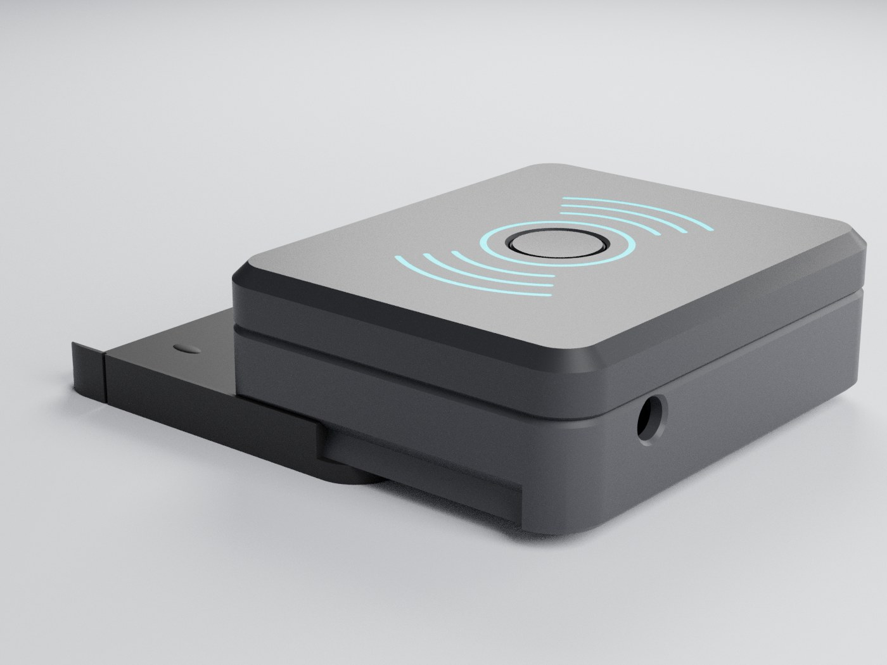

# gesturaware-kasa

GesturAware cihazinin 3D baski kasasi (OpenSCAD).


## Dosyalar

- `kontrolcukasa.scad` - **kontrolcu surumu (yeni).** Oyun kontrolcusunun arkasina takilan, hizli cikarilabilir 3 parcali kasa: kapak + govde + kizak. `goster` degiskeni ile gorunum / parca secilir.
- `Cihazkasaguncel.scad` - masaustu surumu, iki parcali kasa (ust + alt), birlesik dosya. `goster` degiskeni ile gorunum secilir ("ust" / "alt" / "baski" / "acilim" / "montaj").
- `cihazkasaguncelust.scad` - masaustu ust kasa (tek parca, baski icin)
- `cihazkasaguncelalt.scad` - masaustu alt kapak (tek parca, baski icin)
- `cihaz_kasasi.scad`, `yenikasaa_ust.scad`, `yenikasaa_alt.scad` - onceki tasarim iterasyonlari
- `render/` - kontrolcu surumunun gorselleri

## Kontrolcu surumu (`kontrolcukasa.scad`)

Dis olculer degismedi: **64.74 x 53.5 x 20.6 mm** (kizakla birlikte 23.0 mm).
PCB yerlesimi, 12 mm buton, arka 5 mm LED, alt sensor ve reset
delikleri `Cihazkasaguncel.scad` ile ayni konumda. USB-C acikligi ondan 1.4 mm sola
(X = -0.4) ve 0.5 mm asagi (alt kenar Z = 3.5) alindi.


### Tasarim

- Duz ust yuzey, 45 derece pahli ust kenar (isikta keskin bir cizgi verir)
- Buton cevresinde hale halkasi ve iki yanda "(( o ))" jest dalgalari, 0.4 mm oyma
- Kapak / govde birlesiminde 0.6 mm V-golge cizgisi; USB-C ve LED tamamen govdede, birlesim cizgisi portlari kesmiyor
- Kizakla birlikte yandan bakinca uc bant: kapak, govde, kizak (aralarinda ayni V-cizgi)
- Plan kose radiusu 8 -> 6 mm: daha "tech" gorunum ve PCB kosesine pay

| Ust yuzey | Beyaz kapak secenegi |
|---|---|
|  |  |

### Kontrolcuye montaj (kizak)

- Kizak, kontrolcunun arkasina VHB cift tarafli bantla yapisir (orn. 3M VHB 5952 veya 4991).
  Kontrolcu yuzeyini alkolle temizle. Bandi kizagin sol / sag dis seridine, on yarida
  (esnek parmaklarin altina) yapistirma.
- Kasa arkadan kaydirilir. Sol / sag alt kenarlardaki kirlangic (dovetail) profili kasayi asagi kilitler.
- Govdenin arka blogu raylara dayanir: USB kablosu cekilse bile kasa one kacmaz.
- Raylardaki esnek parmaklarin V-sirtlari govdedeki centiklere "klik" diye oturur.
  Cikarmak icin kasayi geriye cekmek yeterli (sarj / reset icin).
- Kizak tabanindaki 0.3 mm tumsekler kasayi raylara bastirir, tikirti yapmaz.



### Ic yapi

- PCB kenarlari govdedeki rafa oturur. Ic kolon / cubuk yok.
- Kapagin ic dudagi govdeye girer: 4 snap topu ile kilitlenir, 4 kucuk tirnakla PCB'yi
  yukaridan bastirir. PCB kontrolcu titresiminde tikirti yapmaz.
- Dudak ile PCB kenari arasinda 0.3 mm pay var. (`Cihazkasaguncel.scad` dosyasinda alt kapak
  dudagi PCB'nin sol, on ve arka kenarina ~0.3 mm giriyor; kart oraya zorla girer.)

### Baski (uc parca da desteksiz)

| Parca | STL icin `goster` | Tablaya gelen yuz | Not |
|---|---|---|---|
| Kapak | `kapak_baski` | ust yuzey | Dokulu PEI tabla premium mat doku verir |
| Govde | `govde_baski` | taban | |
| Kizak | `kizak_baski` | taban | PETG onerilir (esnek parmaklar), en az 3 duvar |

```
openscad -D 'goster="kapak_baski"' -o kapak.stl kontrolcukasa.scad
openscad -D 'goster="govde_baski"' -o govde.stl kontrolcukasa.scad
openscad -D 'goster="kizak_baski"' -o kizak.stl kontrolcukasa.scad
```

**Renkli oyma (tek nozul):** 0.2 mm katmanla kapakta 0.4 mm'den sonraki ilk katmanda (3. katman)
filament degistir (M600), bir sonraki katmanda ana renge don. Oyuklar vurgu renginde gorunur,
ust pahta da ince bir vurgu cizgisi cikar. Cok renkli yazicida `inlay_baski` STL'ini kapakla
ayni nesneye parca olarak ekle.

### Montaj sirasi

1. PCB'yi govdeye yerlestir (USB-C one, on duvardaki acikliga gelir); PCB kenarlari rafa oturur.
2. LED'i arka duvardaki 5 mm delige icten tak.
3. Kapagi bastir: dudak govdeye girer, snap'ler klik yapar.
4. Kasayi kizaga arkadan kaydir, klik sesine kadar it.

### Ayarlar

| Degisken | Varsayilan | Ne yapar |
|---|---|---|
| `ad_bosluk` | 0.15 | Ray boslugu. Kizak cok sikiysa 0.2 - 0.25 |
| `kilit_sirt` | 0.6 | Kizak klik sertligi |
| `ad_sikistir` | 0.3 | Tikirti alma tumsekleri. Kizak zor kayiyorsa 0.15 veya 0 |
| `snap_int` | 0.4 | Kapak kilit sertligi |
| `tirnak_x` | montaj delikleri yani | PCB bastirma tirnaklari. Bu noktalarda PCB kenarinin 0.7 mm icinde komponent olmamali; gerekirse `tirnak_on = false` |
| `oyma_on`, `yazi_on` | true | Ust desen / alt yazi |
| `pcb_goster` | false | Montaj gorunumlerinde PCB hayaleti |

## Masaustu surumu (`Cihazkasaguncel.scad`)

- Apple / minimalist tarz, duz ust yuzey
- Ortada 12 mm buton deligi
- On (-Y) duvarda USB-C acikligi (merkeze gore 1 mm saga kaydirilmis)
- Vidasiz snap kenetlenme: alt kapak lip'i uzerinde detent toplari, ust kasa ic duvarinda eslesen yuvalar. Sikilik `snap_int` ile ayarlanir.

## Kullanim

OpenSCAD ile ac, F5 onizleme / F6 render, sonra STL disa aktar (F7).

Dis olculer: ~64.7 x 53.5 x 20.6 mm.
