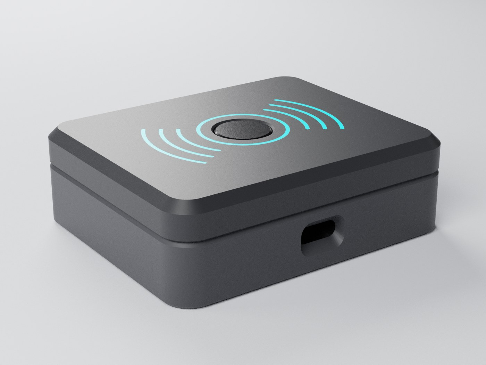
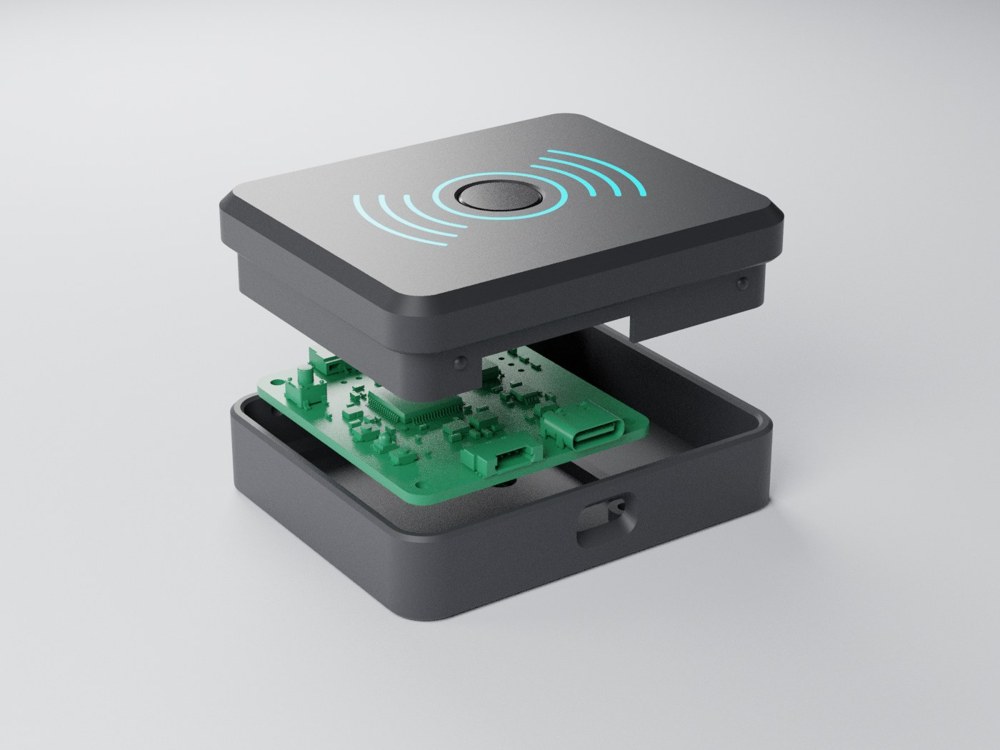
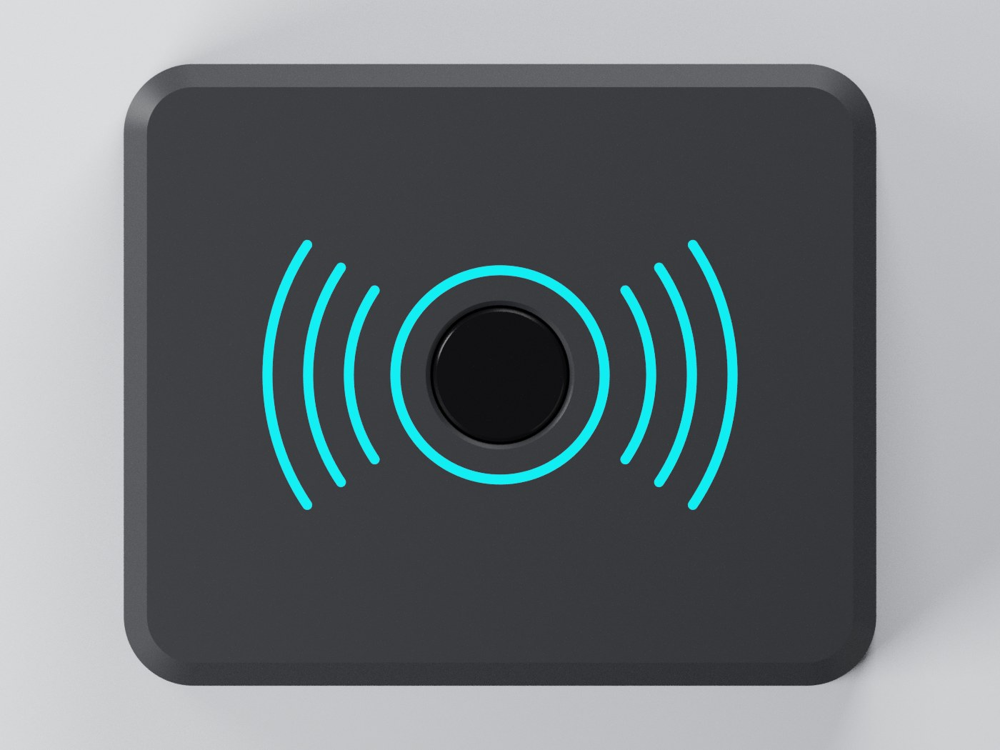
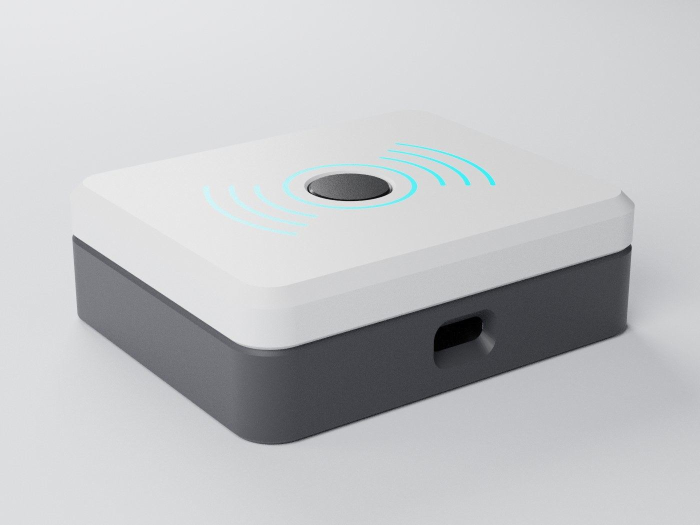
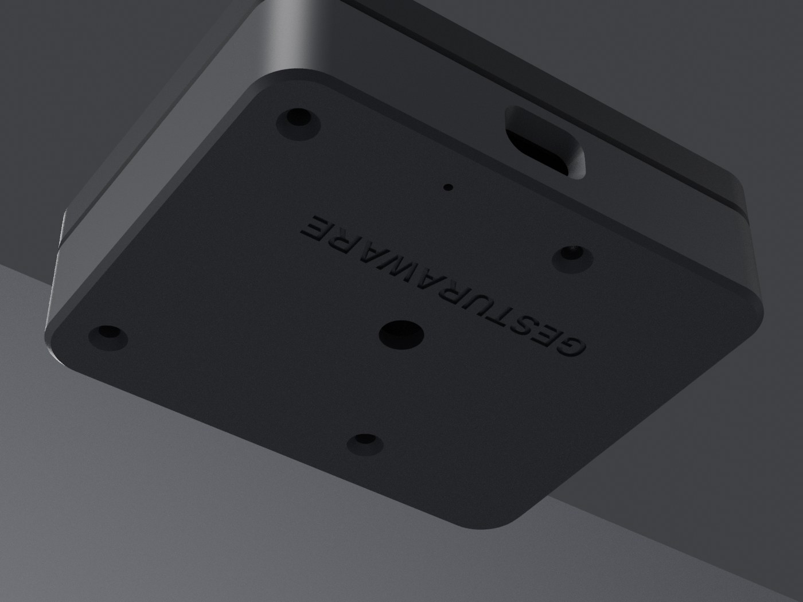

# gesturaware-kasa

GesturAware cihazinin 3D baski kasasi (OpenSCAD).



## Dosyalar

- `kontrolcukasa.scad` - **kontrolcu surumu (yeni).** Oyun kontrolcusunun arkasina takilan 2 parcali kasa: kapak + govde. PCB v1 (`pcb_v1_headers_z.stl`) icin. `goster` degiskeni ile gorunum / parca secilir.
- `Cihazkasaguncel.scad` - masaustu surumu, iki parcali kasa (ust + alt), birlesik dosya. `goster` degiskeni ile gorunum secilir ("ust" / "alt" / "baski" / "acilim" / "montaj").
- `cihazkasaguncelust.scad` - masaustu ust kasa (tek parca, baski icin)
- `cihazkasaguncelalt.scad` - masaustu alt kapak (tek parca, baski icin)
- `cihaz_kasasi.scad`, `yenikasaa_ust.scad`, `yenikasaa_alt.scad` - onceki tasarim iterasyonlari
- `render/` - kontrolcu surumunun gorselleri

## Kontrolcu surumu (`kontrolcukasa.scad`)

Dis olculer degismedi: **64.74 x 53.5 x 20.6 mm**. Ic yapi PCB v1'e gore:
kart 45 x 40 x 1.6 mm, M2 delikler 39 x 34 mm aralikla, en yuksek komponent karttan 6.6 mm.
PCB, USB-C one bakacak sekilde 90 derece donuk durur; USB-C acikligi X = -0.4'te,
konnektorun kendi yuksekliginden hesaplanir (Z = 5.55 .. 8.95).



### Tasarim

- Duz ust yuzey, 45 derece pahli ust kenar (isikta keskin bir cizgi verir)
- Buton cevresinde hale halkasi ve iki yanda "(( o ))" jest dalgalari, 0.4 mm oyma
- Kapak / govde birlesiminde 0.6 mm V-golge cizgisi; USB-C ve LED tamamen govdede, birlesim cizgisi portlari kesmiyor
- Plan kose radiusu 8 -> 6 mm: daha "tech" gorunum

| Ust yuzey | Beyaz kapak secenegi |
|---|---|
|  |  |

### Ic yapi ve PCB montaji

- PCB, delikleri altindaki 4 ayaga (2 mm) ve kenar rafina oturur.
- Tabanda PCB deliklerinin tam hizasinda havsali M2 delikler var: M2x8 havsa bas vida alttan,
  somun PCB ustunde. Vida basi taban yuzeyiyle ayni hizada kalir.
- Kapagin ic dudagi govdeye girer: 4 snap topu ile kilitlenir, 4 kucuk tirnakla PCB'yi
  yukaridan bastirir. Dudagin on tarafinda PCB'nin on kenarindan tasan USB-C ve konnektor icin centik var.
- PCB v1 modeli ile kontrol edildi: duvar, dudak ve tirnaklarla cakisma yok, ic duvara en az 0.47 mm pay.



### Baski (iki parca da desteksiz)

| Parca | STL icin `goster` | Tablaya gelen yuz | Not |
|---|---|---|---|
| Kapak | `kapak_baski` | ust yuzey | Dokulu PEI tabla premium mat doku verir |
| Govde | `govde_baski` | taban | |

```
openscad -D 'goster="kapak_baski"' -o kapak.stl kontrolcukasa.scad
openscad -D 'goster="govde_baski"' -o govde.stl kontrolcukasa.scad
```

**Renkli oyma (tek nozul):** 0.2 mm katmanla kapakta 0.4 mm'den sonraki ilk katmanda (3. katman)
filament degistir (M600), bir sonraki katmanda ana renge don. Oyuklar vurgu renginde gorunur,
ust pahta da ince bir vurgu cizgisi cikar. Cok renkli yazicida `inlay_baski` STL'ini kapakla
ayni nesneye parca olarak ekle.

### Montaj sirasi

1. PCB'yi govdeye yerlestir (USB-C one), 4 M2x8 havsa bas vidayi alttan tak, somunlari PCB ustunden sik.
2. LED'i arka duvardaki 5 mm delige icten tak.
3. Kapagi bastir: dudak govdeye girer, snap'ler klik yapar.

### Ayarlar

| Degisken | Varsayilan | Ne yapar |
|---|---|---|
| `usb_cx`, `pcb_cy` | -0.4, -0.7 | PCB konumu (USB-C acikligi ve vida delikleri birlikte kayar) |
| `vida_d`, `havsa_d` | 2.4, 4.4 | M2 gecis deligi ve havsa capi |
| `snap_int` | 0.4 | Kapak kilit sertligi |
| `tirnak_x` | montaj delikleri yani | PCB bastirma tirnaklari; gerekirse `tirnak_on = false` |
| `oyma_on`, `yazi_on` | true | Ust desen / alt yazi |
| `pcb_goster` | false | Montaj gorunumlerinde PCB hayaleti |

## Masaustu surumu (`Cihazkasaguncel.scad`)

- Apple / minimalist tarz, duz ust yuzey
- Ortada 12 mm buton deligi
- On (-Y) duvarda USB-C acikligi (merkeze gore 1 mm saga kaydirilmis)
- Vidasiz snap kenetlenme: alt kapak lip'i uzerinde detent toplari, ust kasa ic duvarinda eslesen yuvalar. Sikilik `snap_int` ile ayarlanir.

## Kullanim

OpenSCAD ile ac, F5 onizleme / F6 render, sonra STL disa aktar (F7).

Dis olculer: ~64.7 x 53.5 x 20.6 mm.
